# LabHub Intelligence

A laboratory inventory analytics platform built on a custom data warehouse — tracking stock movements, expiration risk, vendor performance, and user compliance across multi-site research facilities.


## 📌 Overview
LabHub is a full-stack analytics pipeline that ingests operational data from a SQL Server OLTP system, transforms it into a dimensional warehouse in DuckDB, and exposes it through an interactive Streamlit dashboard. It is designed for research labs that need visibility into reagent consumption, supply chain reliability, and audit-level traceability of every stock movement.

**Stack:** Python · SQL Server · DuckDB · Streamlit · Plotly

## Business Questions

- **Expiration risk tracking** — per-product, per-location visibility with 30/60/90-day windows
- **SCD2 dimension history** — full temporal tracking of product, user, and status changes
- **Incremental ETL** with data quality gates — warehouse only commits if all DQ checks pass
- **Multi-tab Streamlit dashboard** — product visibility, lineage & traceability, user accountability, semantic search, and system health
- **After-hours movement audit** — flags inventory events outside standard operating hours
- **Vendor freshness scorecard** — ranks vendors by average remaining shelf life at delivery
- **Process integrity gaps** — surfaces users with negative balance events for retraining
---

## 📁 Project Structure


```
LabHub_v2/
├── analytics/
│   ├── warehouse/
│   │   ├── connect_db.py          # OLTP + warehouse connection factories
│   │   ├── create_schema.py       # DuckDB schema DDL
│   │   └── create_views.py        # 18 analytics views
│   └── etl/
│       ├── run_pipeline.py        # Orchestrator — full ETL + DQ + commit
│       ├── data_quality.py        # DQ checks and reporting
│       ├── dimensions/
│       │   ├── dim_date.py
│       │   ├── dim_product.py     # SCD2
│       │   ├── dim_user.py        # SCD2
│       │   ├── dim_location.py    # SCD1
│       │   ├── dim_status.py      # SCD2
│       │   ├── dim_stock_event.py # SCD1
│       │   ├── dim_storage_conditions.py
│       │   └── dim_vendor.py      # SCD3
│       └── facts/
│           ├── fact_inventory.py
│           └── fact_purchase_orders.py
└── app/
    ├── app.py                     # Streamlit dashboard entry point
    └── styles.py
```

---

## Data Pipeline
 
```
SQL Server OLTP
  └── inventory.* · supply.* · core.* · link.*
          │
          │  get_oltp_connection()
          ▼
   ETL Pipeline — run_pipeline.py
   ┌─────────────────────────────────────┐
   │  1. Derive effective_date from OLTP │
   │  2. Load 8 dimension tables         │
   │  3. Dimension DQ gate               │
   │  4. Load 2 fact tables              │
   │  5. Full warehouse DQ audit         │
   │  6. COMMIT or ROLLBACK              │
   └─────────────────────────────────────┘
          │
          │  get_warehouse_conn()
          ▼
   DuckDB Warehouse — dw schema
   └── Dims · Facts · 18 analytics views
          │
          │  read_only=True
          ▼
   Streamlit Dashboard — app.py
```
 
---
 
## Dimensional Model

```mermaid
erDiagram
 
    Fact_Inventory_Transactions {
        bigint TransactionID PK
        bigint ProductKey FK
        int EventDateKey FK
        int DeliveryDateKey FK
        int ExpirationDateKey FK
        bigint LocationKey FK
        bigint UserKey FK
        bigint StockEventKey FK
        bigint StorageConditionKey FK
        varchar LotNumber
        decimal QuantityDelta
        decimal AbsoluteQuantity
        decimal CurrentStockSnapshot
    }
 
    Fact_Purchase_Orders {
        bigint PurchaseOrderID PK
        bigint ProductKey FK
        int OrderDateKey FK
        int DeliveryDateKey FK
        bigint VendorKey FK
        bigint StatusKey FK
        bigint RequestedByKey FK
        bigint StorageConditionKey FK
        decimal QuantityOrdered
        decimal TotalCost
        int VendorLeadTimeDays
    }
 
    Dim_Product {
        bigint ProductKey PK
        bigint ProductID
        varchar ProductName
        varchar CategoryName
        varchar UnitOfMeasure
        decimal unit_cost
        timestamp EffectiveDate
        timestamp EndDate
        bit IsCurrent
    }
 
    Dim_User {
        bigint UserKey PK
        bigint UserID
        varchar UserName
        varchar UserRole
        varchar DepartmentName
        timestamp EffectiveDate
        timestamp EndDate
        bit IsCurrent
    }
 
    Dim_Location {
        bigint LocationKey PK
        bigint LocationID
        varchar SiteName
        varchar Building
        varchar RoomNumber
        varchar StorageType
        timestamp EffectiveDate
        timestamp EndDate
        bit IsCurrent
    }
 
    Dim_Date {
        int DateKey PK
        date FullDate
        int Day
        int Month
        varchar MonthName
        int Quarter
        int Year
        varchar DayOfWeek
        bit IsDayOff
        bit IsAfterHours
    }
 
    Dim_Status {
        bigint StatusKey PK
        bigint StatusID
        varchar StatusName
        varchar StatusCategory
        timestamp EffectiveDate
        timestamp EndDate
        bit IsCurrent
    }
 
    Dim_Stock_Event {
        bigint StockEventKey PK
        bigint StockEventID
        varchar StockEventType
        varchar StockEventReason
        varchar EventDescription
        timestamp LastUpdated
    }
 
    Dim_Storage_Conditions {
        bigint StorageConditionKey PK
        bigint StorageConditionID
        varchar ConditionName
        int MinTemp
        int MaxTemp
        varchar ConditionDescription
        timestamp LastUpdated
    }
 
    Dim_Vendor {
        bigint VendorKey PK
        bigint VendorID
        varchar VendorName
        varchar VendorPreviousName
        varchar VendorStatus
        varchar VendorPreviousStatus
        timestamp EffectiveDate
    }
 
    Fact_Inventory_Transactions }o--|| Dim_Product : "ProductKey"
    Fact_Inventory_Transactions }o--|| Dim_User : "UserKey"
    Fact_Inventory_Transactions }o--|| Dim_Location : "LocationKey"
    Fact_Inventory_Transactions }o--|| Dim_Date : "EventDateKey"
    Fact_Inventory_Transactions }o--|| Dim_Stock_Event : "StockEventKey"
    Fact_Inventory_Transactions }o--|| Dim_Storage_Conditions : "StorageConditionKey"
 
    Fact_Purchase_Orders }o--|| Dim_Product : "ProductKey"
    Fact_Purchase_Orders }o--|| Dim_User : "RequestedByKey"
    Fact_Purchase_Orders }o--|| Dim_Date : "OrderDateKey"
    Fact_Purchase_Orders }o--|| Dim_Status : "StatusKey"
    Fact_Purchase_Orders }o--|| Dim_Vendor : "VendorKey"
    Fact_Purchase_Orders }o--|| Dim_Storage_Conditions : "StorageConditionKey"
```
 

 
### SCD Strategy
 
| Dimension | Type | Strategy |
|---|---|---|
| `Dim_Product` | SCD2 | New row on any attribute change; `EffectiveDate`/`EndDate`/`IsCurrent` |
| `Dim_User` | SCD2 | New row on role or department change |
| `Dim_Status` | SCD2 | New row on status name or category change |
| `Dim_Location` | SCD1 | In-place overwrite — no history required |
| `Dim_Stock_Event` | SCD1 | In-place overwrite via `LastUpdated` |
| `Dim_Storage_Conditions` | SCD1 | In-place overwrite |
| `Dim_Vendor` | SCD3 | Current + previous name/status columns; single-row per vendor |
| `Dim_Date` | Static | Generated from OLTP date boundaries; never updated |
 
---
 
## ETL Design
 
### Effective date
 
All SCD2/SCD3 dimensions are stamped with an `effective_date` derived from the earliest `StockEvent.EventDate` in the OLTP, not `datetime.now()`. This ensures fact table date-range joins resolve correctly against historical generated data:
 
```python
# run_pipeline.py
effective_date = get_data_effective_date()  # MIN(EventDate) from OLTP
```
 
### DQ gate
 
The pipeline runs two quality checkpoints. The first runs after dimensions load and blocks fact loading if any dimension is empty or has orphaned keys. The second runs after facts load and blocks the final commit. The warehouse is never left in a partial state — any failure triggers a full rollback.
 
```
Dims loaded → DQ check → PASS → Facts loaded → DQ check → PASS → COMMIT
                       → FAIL → ROLLBACK              → FAIL → ROLLBACK
```
 
### Incremental loading
 
Facts use `WHERE NOT EXISTS` guards on their natural keys (`TransactionID`, `PurchaseOrderID`) so re-runs never duplicate rows. Dimensions use the SCD pattern appropriate to their type.
 
---
 
## Dashboard
 
Run with:
 
```bash
streamlit run app/app.py
```
 
| Tab | Contents |
|---|---|
| Product Visibility | Expiration exposure chart · location risk ranking · shelf-life gauge · hotspots · global demand · distribution buffers · 12-month trends |
| Lineage & Traceability | Dwell-time box plot · leakage report · vendor freshness scorecard · movement audit trail |
| User Accountability | Consumption leaderboard · after-hours time series · process compliance matrix · waste/usage ratio |
| Semantic Search | Natural language search (requires embedding model integration) |
| System Health | Row counts · SCD2 duplicate audit |
 
---
 
## Setup
 
### Requirements
 
```
python >= 3.11
duckdb
pandas
streamlit
plotly
pyodbc
sqlalchemy
```
 
### Environment
 
Configure your OLTP connection in `analytics/warehouse/connect_db.py`:
 
```python
OLTP_CONN_STR = (
    "DRIVER={ODBC Driver 18 for SQL Server};"
    "SERVER=your_server;"
    "DATABASE=your_db;"
    "UID=your_user;"
    "PWD=your_password;"
)
WAREHOUSE_DB = Path("path/to/warehouse.duckdb")
```
 
### Run the pipeline
 
```bash
python -m analytics.etl.run_pipeline
```
 
### Inspect the warehouse directly
 
```python
from analytics.warehouse.connect_db import get_warehouse_conn
 
conn = get_warehouse_conn()
try:
    df = conn.execute("SELECT * FROM dw.v_movement_log LIMIT 10").fetchdf()
    print(df)
finally:
    conn.close()
```
 
---
 
## Known Limitations
 
- `Fact_Purchase_Orders.VendorKey` is currently nullable — the vendor JOIN in the PO extract is deferred pending a stable `VendorProductLink` relationship in the source system.
- `Dim_Date.IsAfterHours` is non-functional — the column cannot be computed from a date-only dimension. After-hours detection requires an `IsAfterHours` flag derived from `DATEPART(hour, EventDate)` and stored directly on the fact table.
- Semantic search tab requires an external embedding model (e.g. a local Ollama instance or OpenAI embeddings) wired into the query handler.
